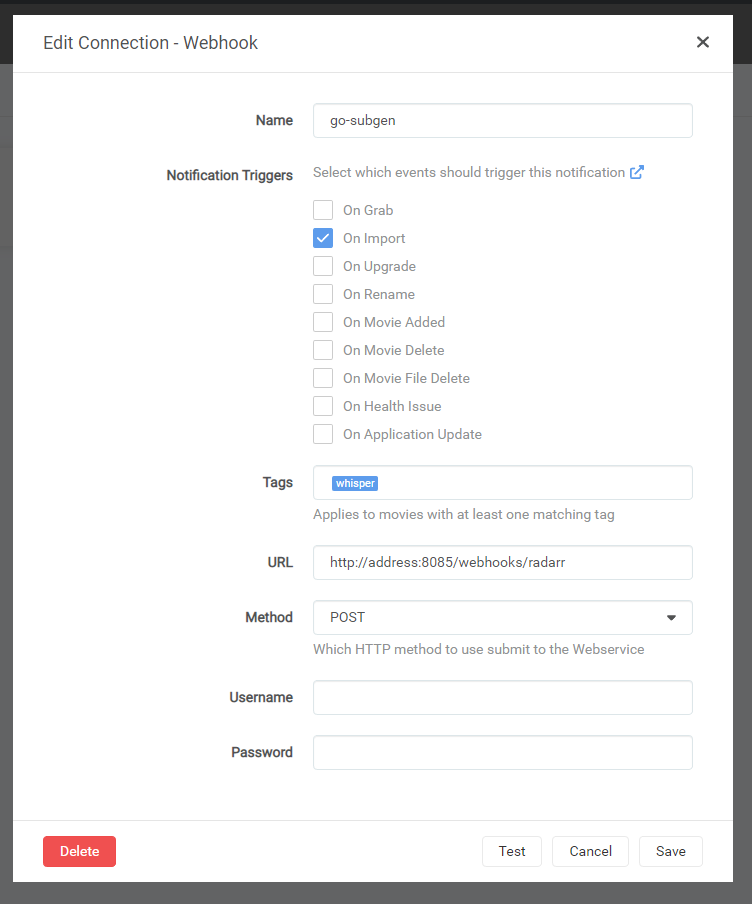
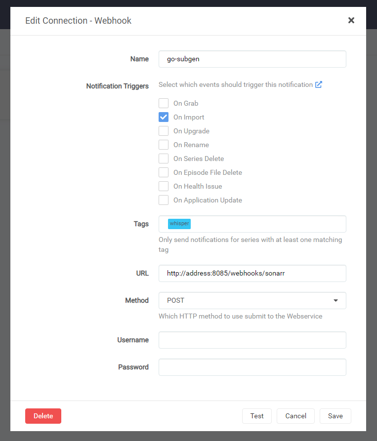

# go-subgen

Automatic subtitle generation for your media using [whisper.cpp](https://github.com/ggerganov/whisper.cpp).

Runs a webserver that upon receiving a webhook with a file path will use whisper.cpp to generate subtitles for your media and output them as an .srt
file.

Whisper.cpp is CPU and RAM intensive depending on the model you use, and go-subgen stores the stripped
audio in memory instead of saving it to the filesystem. If you have large media files you will need lots of ram.

## Features

* Sonarr & Radarr webhook support
* basic Tautulli webhook support
* Subtitle filename templating (see [subfile-name-templating](#subfile-name-templating))
* File queueing

## Todo/Future

* Further software integrations
* Persistent Queue 
* Translation and more advanced media checking (don't run if file already has subs, for example)
* A basic web ui to queue transcription and view queued/in progress tasks.
* Support for different models of whisper? (faster-whisper, openai whisper)
* Filesystem watching support
* Integration into Bazarr as a provider (Not sure how to go about this, please open an issue if you have any ideas)
* CLBLAST & CUBLAS support for GPU acceleration

## Docker

### Docker Compose

```yaml
version: "3.8"
services:
  subgen:
    image: ghcr.io/khakers/go-subgen:master
    restart: unless-stopped
    ports:
      - "8095:8095"
    volumes:
      # Path must be identical to the path in your other services
      - /path/to/your/media:/media
      # Models will be downloaded to this directory
      - models:/models
    environment:
      - MODEL_TYPE=base_en
volumes:
  models:
```

## Web API Endpoints

### Healthcheck

GET

`/healthcheck`

Returns 200 if the server is running

### Tautulli

POST

`/webhooks/tautulli`

Which is designed around being compatible with subgens Tautulli webhook and accepts the same json payload

However, go-subgen currently only uses 'file' and ignores the rest of the json data.

```json
{
  "event": "",
  "file": "{file}",
  "filename": "{filename}",
  "mediatype": "{media_type}"
}
```

### Generic

POST

`/webhooks/generic`

A very basic post endpoint that accepts a json array of file paths

```json
{
  "files": [
    "/path/to/file.mp4",
    "/path/to/other/file.mkv"
  ]
}
```

### Radarr

POST

`/webhooks/radarr`

Accepts Radarr formatted webhooks

<details>
<summary>Example webhook configuration</summary>



This example only sends the notification on series that have the 'whisper' tag, allowing you to only transcribe series
that need it.
</details>

### Sonarr

POST

`/webhooks/sonarr`

Accepts Sonarr formatted webhooks

<details>
<summary>Example webhook configuration</summary>



This example only sends the notification on series that have the 'whisper' tag, allowing you to only transcribe series
that need it.

</details>

## Configuration

### Subfile name templating

Go-Subgen allows you to configure how subtitle files are name using Go templates.

The default filename templates is as follows:
`{{.FileName}}.subgen.{{.Lang}}.{{.FileType}}`

You can set your own template by setting the environment variable `SUBTITLE_NAME_TEMPLATE`. The template is created
using the struct below. You can use any of the variables provided and any features of the Go templating system, but keep
in mind no escaping is applied to the result. Additionally, FileHash ***is not*** a SHA hash. It is a hash generated
using imohash
which hashes only portions of the file using murmur3

```go
type SubtitleTemplateData struct {
  FilePath  string
  FileName  string
  Lang      string
  FileHash  string
  FileType  string
  ModelType string
}
```

## Options

| Environment Variable                | Type      | Default                                        | Description                                                                                                  |
|-------------------------------------|-----------|------------------------------------------------|--------------------------------------------------------------------------------------------------------------|
| MODEL_TYPE                          | Model     | base_en                                        | Whisper.cpp Model version `Tiny_en, Tiny Base_en, Base, Small_en, Small, Medium_en, Medium, Large_v1, Large` |
| TARGET_LANG                         | string    | en                                             |                                                                                                              |
| IGNORE_IF_EXISTING                  | bool      | true                                           |                                                                                                              |
| MAX_CONCURRENCY                     | uint      | 1                                              |                                                                                                              |
| MODEL_DIR                           | string    | /models/                                       |                                                                                                              |
| LOG_LEVEL                           | log.Level | info                                           |                                                                                                              |
| VERIFY_MODEL_HASH                   | bool      | true                                           | Verify that the downloaded model mashes the expected hash                                                    |
| PORT                                | uint8     | 8095                                           | Web server port                                                                                              |
| SUBTITLE_NAME_TEMPLATE              | string    | "{{.FileName}}.subgen.{{.Lang}}.{{.FileType}}" | [See Subfile-name-templating](#Subfile-name-templating)                                                      |
| WHISPER_CONF_THREADS                | uint      |                                                | Number of threads to run Whisper.cpp on                                                                      |
| WHISPER_CONF_WHISPER_SPEEDUP        | bool      |                                                |                                                                                                              |
| WHISPER_CONF_TOKEN_THRESHOLD        | float32   |                                                |                                                                                                              |
| WHISPER_CONF_TOKEN_SUM_THRESHOLD    | float32   |                                                |                                                                                                              |
| WHISPER_CONF_MAX_SEGMENT_LENGTH     | uint      |                                                |                                                                                                              |
| WHISPER_CONF_MAX_TOKENS_PER_SEGMENT | uint      |                                                |                                                                                                              |


## Acknowledgements

Inspired by [McCloudS/subgen](https://github.com/McCloudS/subgen) but written in Go and for more generic usage.
